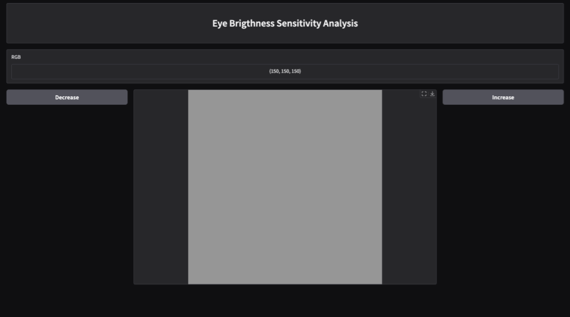

# Görüntü İşleme: Parlaklık Algılama

Bu proje, insan gözünün parlaklık algılamasını daha doğru bir şekilde modellemek amacıyla gerçekleştirilmiştir. Yapılan araştırmalar sonucunda, insan gözünün parlaklık farklarını lineer değil, logaritmik bir düzende algıladığı tespit edilmiştir. Bu çalışma, dijital görüntü işleme ve dijital fotoğrafçılık teknolojilerinde daha gerçekçi ve doğrudan etkileşim sağlayan sonuçlar elde edilmesine katkı sağlamayı hedeflemektedir.

## İnsan Gözünün Parlaklık Algılama Özellikleri

İnsan gözünün parlaklık algılaması belirli bir aralıkta küçük değişikliklerde daha belirgin hissedilmektedir. Görsel kaliteyi artırmak ve insan gözünün algısına daha yakın görüntüler elde etmek için bu durumu modellemek oldukça önemlidir. Işık ve renk düzenlemelerinde kullanılan algılama yöntemlerinin optimize edilmesi, görsel kaliteyi artırmak için temel bir adımdır.

Bu uygulama sonucunda, insan gözünün algıladığı 28 farklı parlaklık seviyesi tespit edilmiştir. Bu parlaklık seviyeleri, aşağıda listelenmiştir:

### Algılanan Parlaklık Değerleri

| Parlaklık Değeri (RGB)  | Parlaklık Değeri (RGB)  |
| ----------------------- | ----------------------- |
| (0, 0, 0)               | (78, 78, 78)            |
| (9, 9, 9)               | (92, 92, 92)            |
| (17, 17, 17)            | (98, 98, 98)            |
| (25, 25, 25)            | (120, 120, 120)         |
| (32, 32, 32)            | (245, 245, 245)         |
| (36, 36, 36)            | (132, 132, 132)         |
| (38, 38, 38)            | (150, 150, 150)         | 
| (41, 41, 41)            | (161, 161, 161)         |
| (45, 45, 45)            | (183, 183, 183)         |
| (52, 52, 52)            | (190, 190, 190)         |
| (58, 58, 58)            | (198, 198, 198)         |
| (61, 61, 61)            | (205, 205, 205)         |
| (64, 64, 64)            | (220, 220, 220)         |
| (75, 75, 75)            | (232, 232, 232)         |
                    
## Uygulamanın Amacı

Bu çalışmada, insan gözünün parlaklık algılamasını daha gerçekçi bir şekilde modellemek ve dijital görüntü işleme alanında daha iyi sonuçlar elde etmek hedeflenmiştir. Bu bulguların görsel işleme algoritmalarında ve dijital fotoğrafçılıkta daha gerçekçi ve doğrudan etkileşim sağlayan sonuçlar elde edilmesine katkı sağlaması beklenmektedir.

## Uygulamanın Ekran Görüntüsü

Uygulama ekran görüntüsü aşağıda yer almaktadır.  
  
